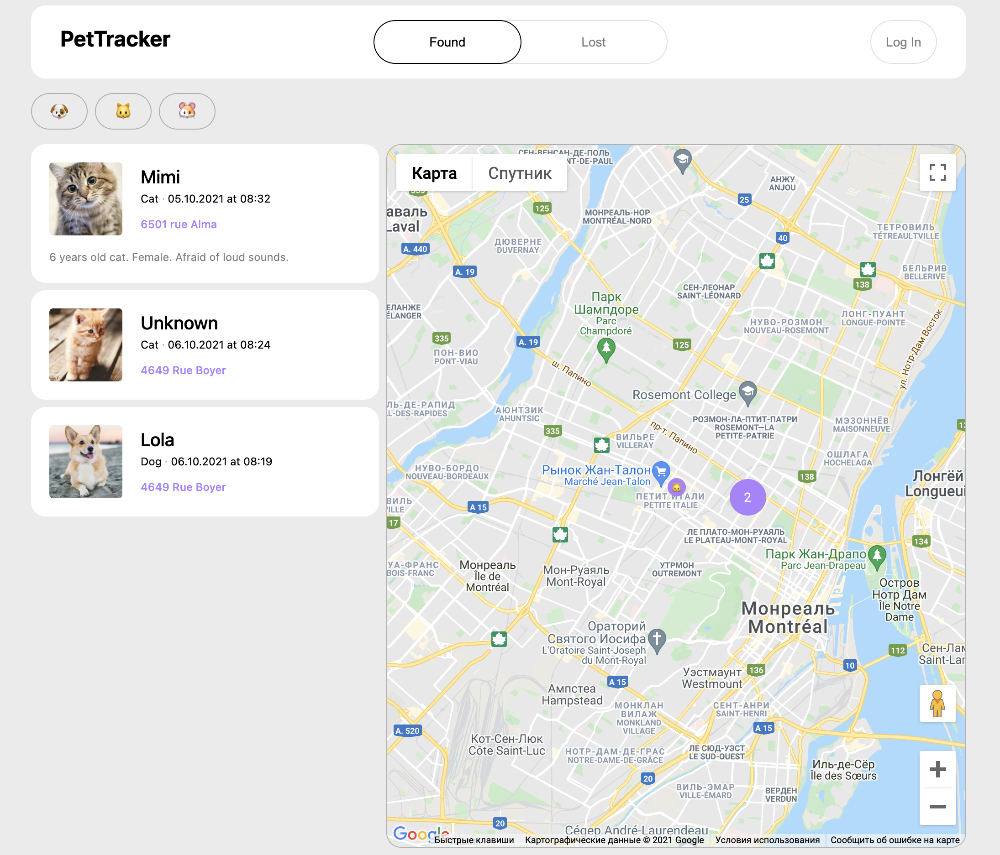
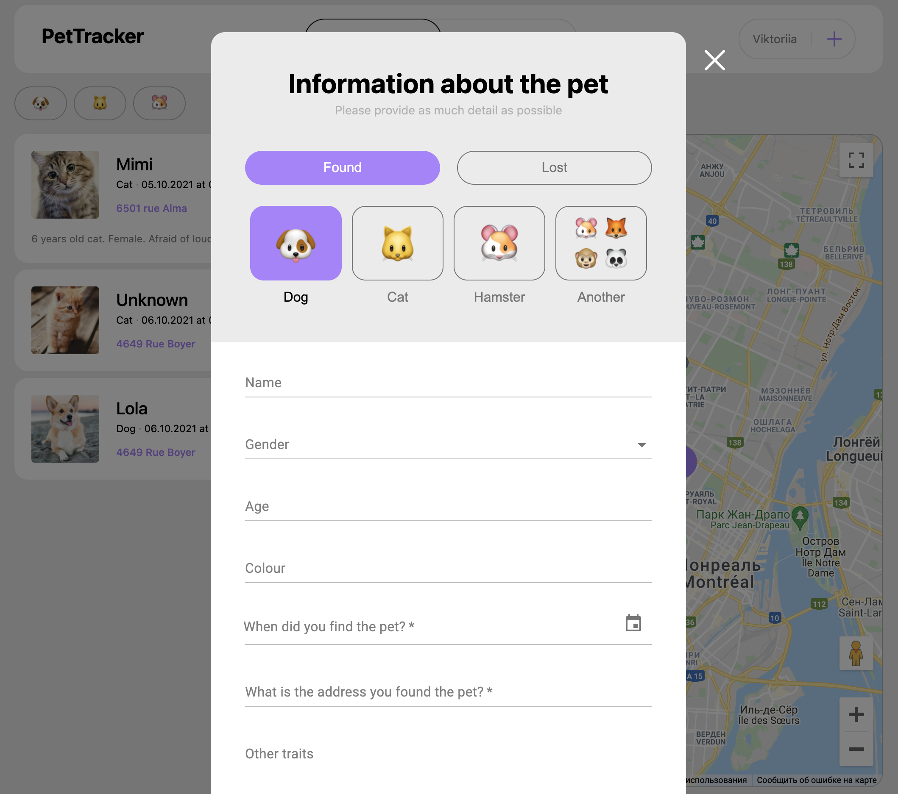
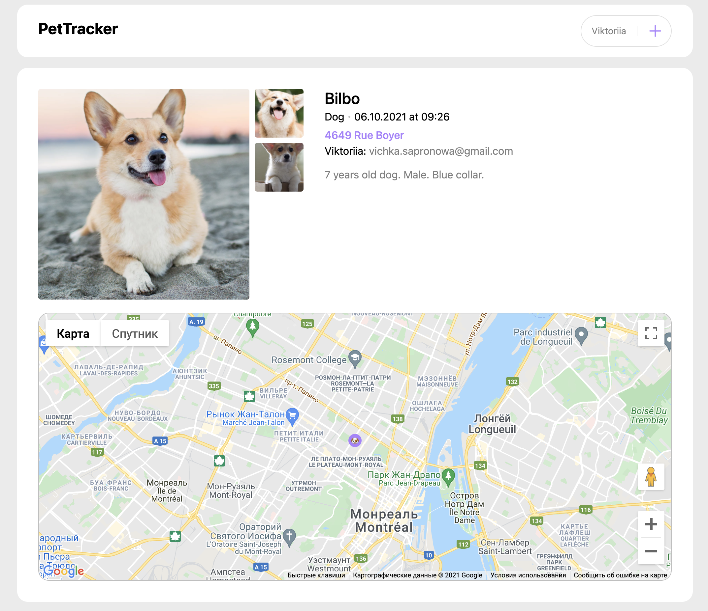
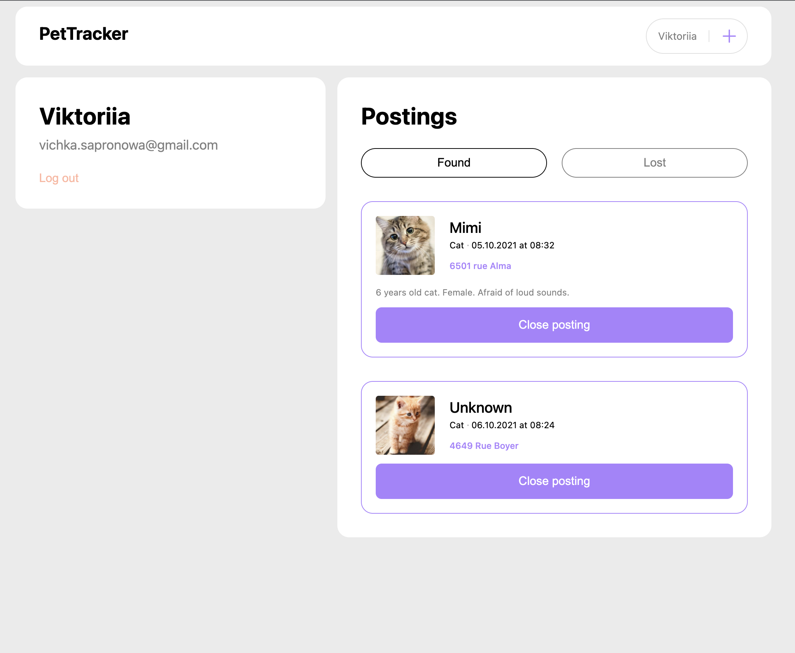

# Pet Tracker

A web application for finding missing pets.









## Getting Started

### Client

1. Type `yarn install` to install all dependencies.
2. Type `yarn start` to run the app in the development mode.

Open [http://localhost:3000](http://localhost:3000) to view it in the browser.

### Server

1. Type `yarn install` to install all dependencies.
2. Type `yarn start` to start the backend dev environment.

Server will be listening on port 8000.

The application needs [Auth0 domian](https://auth0.com/docs/quickstart/spa/react), [Auth0 client](https://auth0.com/docs/quickstart/spa/react) to request and accept authentication and [Google Map API key](https://developers.google.com/maps/documentation/javascript/get-api-key), [Opencage API key](https://opencagedata.com/api) to display the map. These can be configured with environmental variables:

```js
AUTH0_DOMAIN = YOUR_DOMAIN;
AUTH0_CLIENT_ID = YOUR_CLIENT_ID;
GOOGLE_MAP_API_KEY = YOUR_GOOGLE_MAP_API_KEY;
OPENCAGE_API_KEY = YOUR_OPENCAGE_API_KEY;
```

## What is Pet Tracker?

Pet Tracker lets you:

- see the list of missing pets in Montreal;
- see addresses where pets were lost on the map;
- create a profile where you can manage your postings;
- create a posting with the main information about the missing pet, and its photos.

## Future works

- a printing flyer;
- mobile version.

## Feedback

Please feel free to ask the questions and give the feedback.
